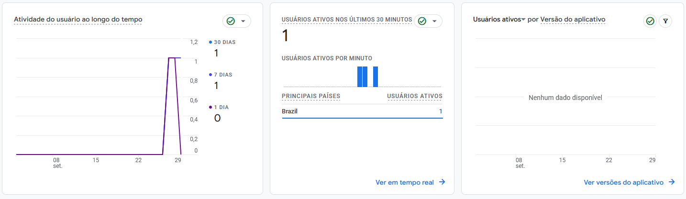
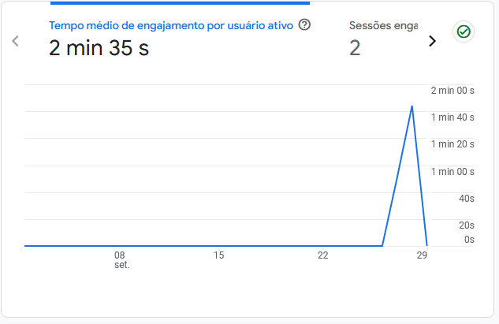
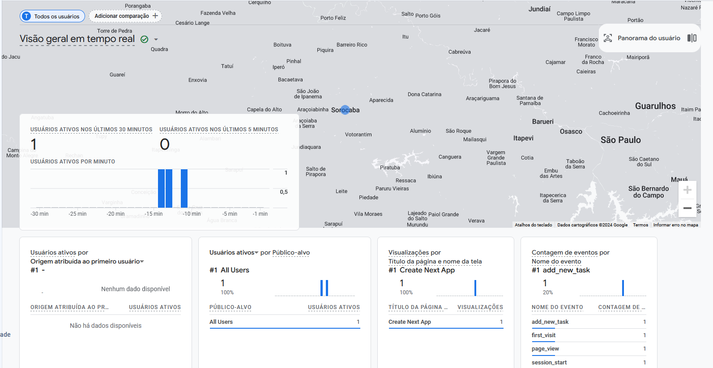
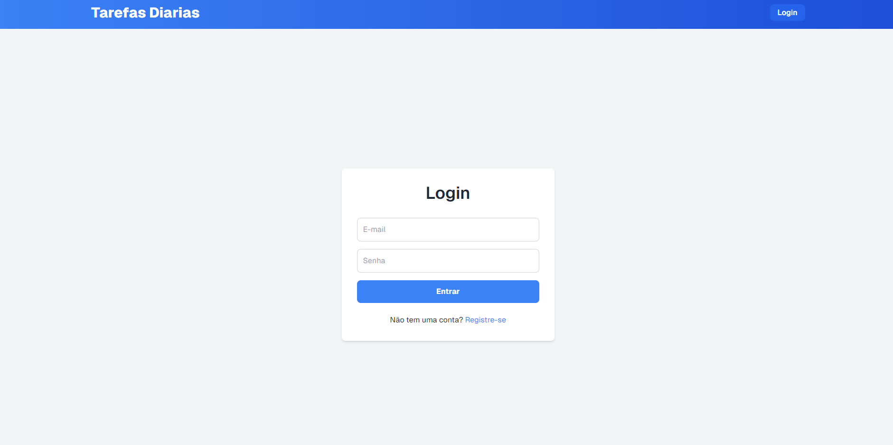
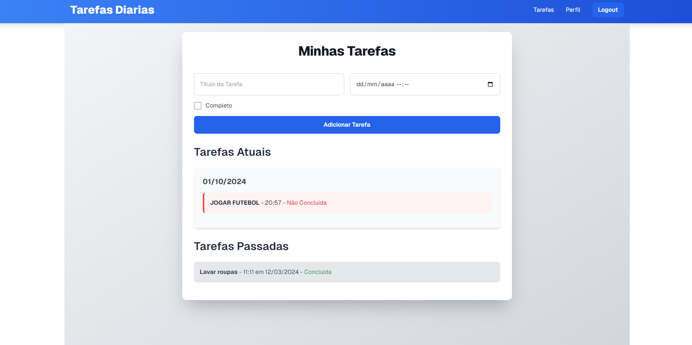
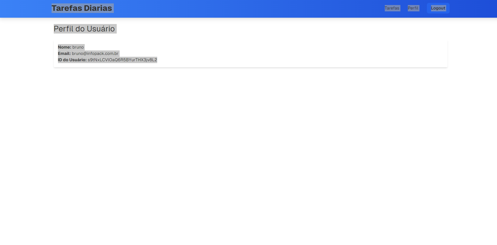
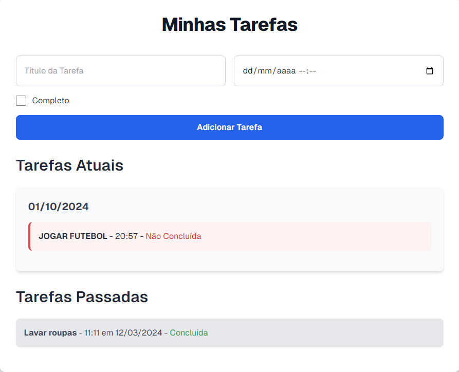

#Aluno:Bruno Rodrigues dos Santos Silva

Disciplina: Desenvolvimento de Apps Híbridos com PWA [24E3_3] 

#Prints

RELATORIO DE USUÁRIOS DO FIREBASE ANALYTICS

RELATORIO DE ENGAJAMENTO DO FIREBASE ANALYTICS

RELATORIO DE USUÁRIOS EM TEMPO DO FIREBASE ANALYTICS

TELA DE LOGIN

TELA DE HOME

TELA DE PERFIL

TELA DE REGISTRO(TAREFAS)

